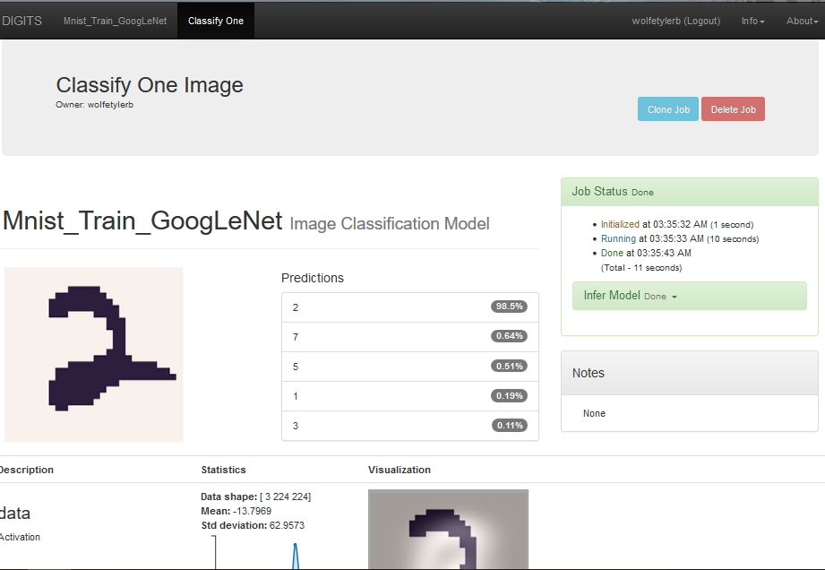

# DeepLearning-MNIST-Handwritting
Image recognition project using the NVIDIA DIGITS environment to train a GoogLeNet CNN to accurately identify handwritten characters

## Abstract
NVIDIA's DIGITS (Deep Learning GPU Training System) provides a training system for neural networks in order to perform image classification, segmentation, and object detection tasks. Within the domain of image classification is an area known as character recognition, whereby a computer program is capable of taking a image of  handwriting as input and converting that into machine-encoded text. To test DIGITS' neural network training capabilities the MNIST handwritten database was utilized using GoogLeNet's 22 layer deep CNN.

## Introduction
The average child learns to read by 6 or 7 years old. Understanding the difference between a numeric 0 and the letter O is a relatively easy task for human readers given a few words of context, however correctly identifying handwritten characters has historically proven more difficult for computers. Due to numerous subtle variations across handwriting styles logical rule-based approaches over the past 3 decades to identify characters have been error-prone. However, in the last 10 years GPU-based deep learning methods have enabled significant improvements in recognition speed and accuracy. NVIDIA's DIGITS provides a GPU-powered training environment for deep learning giving the infrastructure to tackle the handwritten character challenge as efficiently as possible. GoogLeNet is a powerful convolutional neural network that can be utilized with the DIGITS environment to train against a given data source. The MNIST handwritten character database was selected for training and testing given its rich source of tens of thousands of handwritten character samples. 

## Background / Formulation
To perform the task of accurately translating images of characters into encoded digital text an image classification model had to be established and optimized in order for the CNN to train against the dataset. GoogLeNet was selected using a training batch size of 32 and learning rate of 0.01. Initially 10 training epochs were utilized, however it was noted that using a few as 2 training epochs could result in relatively high accuracy. [GoogLeNet](https://medium.com/@sidereal/cnns-architectures-lenet-alexnet-vgg-googlenet-resnet-and-more-666091488df5) was selected due to its demonstrated accuracy leadership in similar character recognition published research. For additional context the following versions were utilized during the course of the model development, training, and testing:
* DIGITS version: 6.1.0
* Caffe version: 0.15.14
* Caffe flavor: NVIDIA

Fig 1: Handwriting Classification Diagram

  

## Data Acquisition
Within the DIGITS environment the first task was the import the training data from the Modified National Institute of Standards and Technology (MNIST) handwriting character database. The data-set includes 45,002 images in total sub-divided into format specific training and validation sub-sets. The handwritten character images are based in greyscale RGB codes from 0 to 255. The labeled digits container labels from 0 to 9. NVIDIA's DIGITS (as well as other leading machine learning environments, including Keras) provide programmatic path to downloading the data into the testing environment

Fig 2: MNIST Handwritten Digits Labeled

  

## Results
Through Epoch 2 the model performed with .962 accuracy and .999 top5 val accuracy running on the supplied GPU-based hardware setup within 24 minutes and 6 seconds. The average inference time after 5 10 run cycles was 4.94ms.

Fig 3: Trained Model Charting - Epoch 2

  

The trained model was also tested against specific local examples of character digits image files. The first example image contains the digit 2 and is predicted by the model to be a 2 with .985 certainty.

Fig 4: Testing Trained Model, Digit 2

  

## Discussion
The model achieved relatively high >=.9 digit recognition accuracy with low inference times <10ms even when reducing the number of training epochs to a low number (ex. 2). While it may be surprising that this can be achieved with such a short training cycle span, it should be noted that even though handwritten digits contain a range of variation in handwriting style there is not as much pixel variance as would be expected when performing classification of complex non-character images such as of a vehicle driving on the road or a dog outside. Unlike images in real-world settings which significant background image noise, handwritten digits have no background image noise or the challenge of multicolored image complexity.

## Conclusion / Future work
The NVIDIA's DIGITS deep learning environment using a trained GoogLeNet CNN is able to correctly perform image classification tasks against the MNIST handwriting digits database with a relatively high degree of accuracy. Future work potential includes more complex use cases of handwritten digits images including multiple digits in the form of tabular data and/or functions and operations with multiple digits. This would require the CNN to not only correctly predict the digit but also to identify when multiple digits are present, if there are functional operations to perform against those multiple digits, and if there is a table of digit data formatted within the image.

